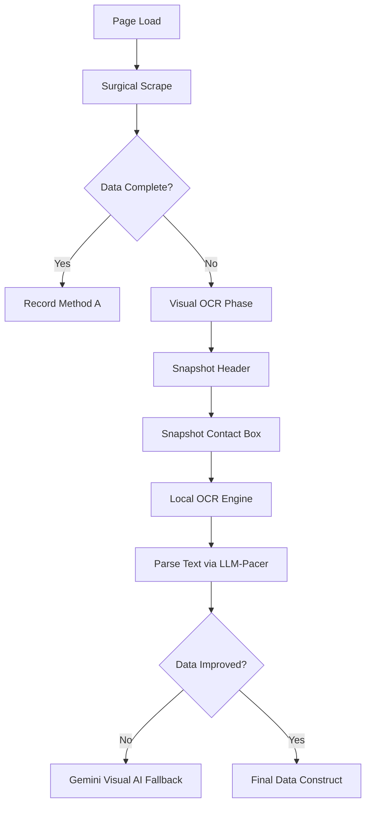

# Hybrid Extraction: A/B Test Design

This document outlines the architecture for comparing the **Current Extraction Flow** (Surgical + Gemini) against the **Hybrid Extraction Flow** (Surgical + Visual OCR + Gemini).

## 1. Test Objectives
*   **Latency Benchmark**: Compare local OCR processing time vs. remote Gemini API latency.
*   **Field Accuracy**: Measure the success rate of extracting Name, Title, Phone, and Email using OCR vs. Surgical Scrape.
*   **Fallback Reliability**: Verify that OCR successfully fills gaps when Surgical Scrape selectors fail due to LinkedIn's dynamic DOM.

## 2. A/B Test Architecture

### Data Capture Structure
For each contact in the test batch, we will record:
*   `contact_name`: Search key.
*   `method_a`: Current Flow Results (Surgical + Gemini fallback).
*   `method_b`: Hybrid Flow Results (Surgical + OCR fallback).
*   `timestamp`: Execution time.

### The "Hybrid" Branch (Branch B) Logic

## 3. Comparison Metrics
| Metric | Definition | Source |
| :--- | :--- | :--- |
| **Extraction Time** | Total ms from page load to final object | `time.time()` |
| **Field Completeness** | % of non-null target fields | Validation script |
| **Matching Score** | Confidence of extracted data vs. Current Search | Identity Fusion logic |
| **API Overhead** | Number of external LLM tokens/calls used | API Log |

## 4. Execution Plan (Simulation Mode)
1.  **Selection**: Choose 5 contacts from Tier 3 with existing "Incomplete" flags.
2.  **Instrumentation**: Implement `ExtractionBenchmarker` class to wrap current `sync_profile` logic.
3.  **Simulation**: Run with `--simulation` and `--ab-test` flags.
4.  **Reporting**: Export `logs/ab_test_comparison_[date].md` with a summary table and detailed findings for each contact.

## 5. Solutions to Challenges

### OCR Engine Selection: Apple Vision Framework (Native Mac)
*   **Decision**: We will prioritize **Apple's Vision Framework** via `pyobjc-framework-Vision`.
*   **Rationale**: 
    *   **Zero Latency**: Local execution avoids network round-trips.
    *   **Zero Cost**: Does not consume Gemini API quota.
    *   **High Accuracy**: Native macOS OCR is optimized for high-contrast UI text.
*   **Fallback**: If native Vision is unavailable, we will use a **"Thin OCR" Prompt** with Gemini Flash (requesting raw text only, no structure).

### Window Management: Atomic Snapshotting
*   **Strategy**: Use Playwright's atomic selector screenshotting.
    *   **Step 1**: Target the header using `.pv-text-details__left-panel`.
    *   **Step 2**: Open "Contact Info" via `.pv-top-card--list a[href*="contact-info"]`.
    *   **Step 3**: Capture *only* the `.pv-contact-info` modal element.
    *   **Step 4**: Atomic resolution - Close the modal immediately after capture to minimize page state changes.
*   **Benefit**: By snapshotting *elements* rather than the whole viewport, we eliminate noise from the LinkedIn background and banner images.

## 6. Comparison Document Template (Planned)
The A/B test will populate a markdown table with the following columns:
| Contact | Surgical Scrape (Fields Found) | Hybrid OCR (Fields Found) | 🏆 Winner | Duration Delta |
| :--- | :--- | :--- | :--- | :--- |
| Jane Doe | Name, Title | Name, Title, Phone | **Hybrid** | +1.2s |
